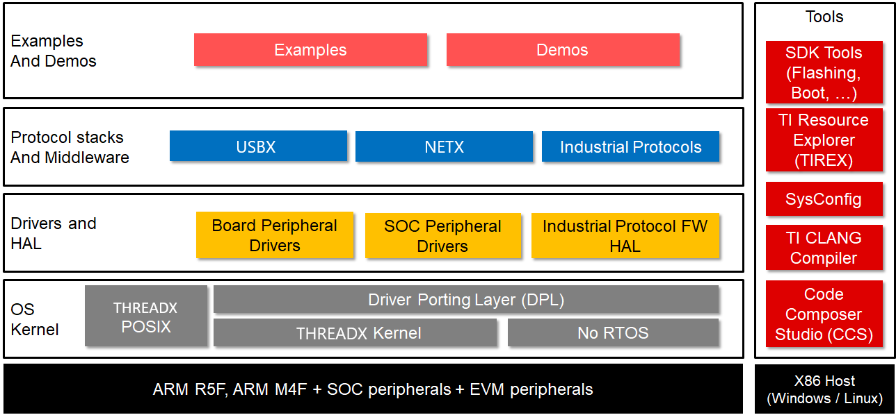

<div align="center">

<br/>
# THREADX as RTOS

</div>

## Introduction to THREADX
---

Eclipse ThreadX is an advanced real-time operating system (RTOS) designed specifically for deeply embedded applications. Among the multiple benefits it provides are advanced scheduling facilities, message passing, interrupt management, and messaging services. Eclipse ThreadX RTOS has many advanced features, including picokernel architecture, preemption threshold, event chaining, and a rich set of system services.

Here are the key features and modules of ThreadX:
<div align="center">
<br/>
</div>

### Components of Eclipse ThreadX

The Eclipse ThreadX platform is the collection of run-time solutions including ThreadX, NetX Duo, FileX, GUIX and USBX.
- **ThreadX** : advanced Real-Time Operating System (RTOS) designed specifically for deeply embedded applications. Among the multiple benefits ThreadX provides are advanced scheduling facilities, message passing, interrupt management, and messaging service
- **FileX** : FileX is a high-performance FAT-compatible file system and fully integrated with ThreadX
- **GUIX** : GUIX is a professional quality graphical user interface package, created to meet the needs of embedded systems developers
- **NetX Duo** : NetX Duo is an advanced, Industrial Grade TCP/IP network stacks designed specifically for deeply embedded, real-time, and IoT applications
- **USBX** : USBX is a high-performance USB host, device, and On-The-Go (OTG) embedded stack and is fully integrated with ThreadX
- **TraceX** : TraceX is host-based analysis tool that provides developers with a graphical view of real-time system events and enabling better analysis of real-time systems.

<div align="center">
<br/>
</div>

### Reasons why the Eclipse ThreadX stands out as an RTOS:

Eclipse ThreadX provides the following advantages over other real-time operating systems.
- Most deployed RTOS : over 12 billion deployments worldwide
- Intuitive and consistent API design
- High efficiency : Small code footprint, Scalable code footprint based on the services used, Fast execution
- Fastest time-to-market : Complete source code availability, Easy-to-use API, Comprehensive and advanced feature set, Quality documentation
- Full, highest-quality source code
- Pre-certified by TÜV and UL to many safety standards,  EAL4+ Common Criteria security certification, FIPS 140-2 Validated

For more information visit Eclipse ThreadX documentation: https://github.com/eclipse-threadx/rtos-docs

<div align="center">
  
   
  
</div>


## Overview : TI platforms with ThreadX
---
Texas Instruments is empowering its following platforms with the ThreadX RTOS currently:
- [AM243](https://www.ti.com/product/AM2434)
- [AM62A](https://www.ti.com/product/AM62A7)

This ThreadX offering is provided as part of TI's MCU+SDK codebase, which is designed with user experience and simplicity in mind. This offering includes out-of-box application examples and peripheral usage examples to help users hit the ground running.
Please note, the threadX offering is **not** available in the TI SDKs available on ti.com, it's hosted on github currently and steps to set it up are shared in the later sections of this document.

### Features of MCU+SDK

- Out of Box peripheral and application Examples
  - Peripheral Level Examples: UART, ADC, I2C, SPI etc.
  - Application Level Examples.

- Protocol stacks and middleware
  - USBX : USB stack
  - FileX : FAT filesystem
  - NetX : network stack
  - LwIP
  - Various Industrial Protocol Stacks

- Drivers and Hardware Abstraction Layer
  - Board peripheral drivers - Flash, EEPROM, LED etc.
  - SoC peripheral drivers - I2C, SPI, OSPI, ADC etc.

- Industrial protocol firmware

- OS kernel layer
  - Driver Porting Layer(DPL) which acts as an abstraction layer between driver and OS
  - Out of Box Support for
    - THREADX
    - Baremetal i.e NO RTOS builds

<div align="center">

<br/>
</div>

### ThreadX features currently supported on TI platforms:

- **AM243X**
  - **Cores supported**: Kernel Cortex-R5 with TI toolchain split mode dual instance
  - **Drivers**: GPIO, I2C, SPI/McSPI, UART & Timers
  - **Filesystem and Storage**: Filex, RAMDISK, SDCard, QSPI flash (serial NOR) , GPMC(NAND), LevelX support
  - **Networking**: NETX, Ethernet
  - **Tools**: Sysconfig integration
  - DMA for supported peripherals, IPC Port for ThreadX(for supported cores)

- **AM62AX**
  - **Cores supported**:
      - Kernel Cortex-R5 with TI toolchain split mode dual instance
      - Support for A53 core in single core configuration
  - **Drivers**: GPIO, I2C, SPI/McSPI, UART & Timers
  - **Filesystem and Storage**: Filex, RAMDISK, SDCard, OSPI flash (serial NAND), LevelX support
  - **Networking**: NETX, Ethernet
  - **Tools**: Sysconfig integration
  - DMA for supported peripherals, IPC Port for ThreadX(for supported cores)

### ThreadX Examples available in MCU+SDK:

- **AM243X**
  - **Kernel**
    - **Hello World**: basic example to illustrate printing message on CCS console and first available virtual COM port every second
    - **Task Switch**: examaple to show usage of ThreadX based task APIs, semaphore and delay APIs 
  - **Filex**
    - **Hello World**: example to demonstrate file I/O operations using the FileX file system
  - **NetX Duo**
    - **Enet NetxDuo CPSW Mac**: TCP/UDP IP application to illustrate ethernet based communication using CPSW as HW mechanism, using the NetxDuo stack coupled with ethernet driver- configured to run in Dual MAC mode
    - **Enet NetxDuo CPSW Switch**: TCP/UDP IP application to illustrate ethernet based communication using CPSW as HW mechanism, using the NetxDuo stack coupled with ethernet driver- configured to run in Switch mode
    - **Enet NetxDuo TCP Client**: Example to implement TCP Client on NetxDuo stack using netconn interface coupled with ethernet driver 
    - **Enet NetxDuo TCP Server**: Example to implement TCP Server on NetxDuo stack using netconn interface coupled with ethernet driver 
    - **Enet NetxDuo UDP Client**: Example to implement UDP Client on NetxDuo networking stack using BSD-Socket API coupled with ethernet driver 
    - **Enet NetxDuo ICSSG Mac** : TCP/UDP IP application to illustrate ethernet based communication using ICSSG as HW mechanism, using the NetxDuo networking coupled with ethernet driver- configured in Mac mode
    - **Enet NetxDuo ICSSG Switch**: TCP/UDP IP application to illustrate ethernet based communication using ICSSG as HW mechanism, using the NetxDuo networking coupled with ethernet driver- configured to run in Switch mode 

- **AM62AX**
  - **Kernel**
    - **Hello World**: basic example to illustrate printing message on CCS console and first available virtual COM port every second
    - **Task Switch**: examaple to show usage of ThreadX based task APIs, semaphore and delay APIs
  - **Filex**
    - **Hello World**: example to demonstrate file I/O operations using the FileX file system
  - **NetX Duo**
    - **Enet NetxDuo CPSW Mac**   : TCP/UDP IP application to illustrate ethernet based communication using CPSW as HW mechanism, using the NetxDuo stack coupled with ethernet driver- configured to run in Dual MAC mode
    - **Enet NetxDuo CPSW Switch**: TCP/UDP IP application to illustrate ethernet based communication using CPSW as HW mechanism, using the NetxDuo stack coupled with ethernet driver- configured to run in Switch mode
    - **Enet NetxDuo TCP Client** : Example to implement TCP Client on NetxDuo stack using netconn interface coupled with ethernet driver
    - **Enet NetxDuo TCP Server** : Example to implement TCP Server on NetxDuo stack using netconn interface coupled with ethernet driver
    - **Enet NetxDuo UDP Client** : Example to implement UDP Client on NetxDuo networking stack using BSD-Socket API coupled with ethernet driver

## Getting Started
---
The following sections guides the user on how to get started with using ThreadX with TI's supported platforms.


#### Prerequisites

#### Supported HOST environments

- Ubuntu 22.04 64bit

#### Clone and build from GIT

##### Repo Tool Setup

MCU+ SDK has multiple components (in multiple repositories) and dependencies
(like compiler, CCS and other tools). We use repo tool from Google to manage these
multiple repositories. Currently there is no support for native windows shells like
CMD or Powershell. West tool is recommeded for other platforms. Windows users can rely on
Git Bash for the repo setup. Follow the below mentioned steps to setup repo tool:

Make sure [python3 is installed](https://wiki.python.org/moin/BeginnersGuide/Download) and is in your OS path.

- Linux:
  Do the following in terminal
  ```bash
  curl https://storage.googleapis.com/git-repo-downloads/repo > ~/bin/repo
  chmod a+x ~/bin/repo
  echo "PATH=$HOME/bin:$PATH" >> ~/.bashrc
  source ~/.bashrc
  ```

#### Cloning The Repositories

To clone the repositories using repo tool, do below in your workarea folder:

- **For am243x threadx setup**

```bash
repo init -u https://github.com/TexasInstruments/mcupsdk-manifests.git -m releases/10_01_00/am243x/mcusdk_threadx.xml -b main
```

- **For am62a threadx setup**

```bash
repo init -u https://github.com/TexasInstruments/mcupsdk-manifests.git -m releases/10_01_00/am62ax/mcusdk_threadx.xml -b k3_main
```

After the repo is initialized, do a

```bash
repo sync
```

This should clone all the repositories required for MCU+ SDK development. Now download and install the dependencies.

Now that the dependencies are installed, you can start the repositories with a
default branch `dev` by doing below:

```bash
repo start dev --all
```

#### Downloading And Installing Dependencies
---

Note that the dependencies are also soc specific, here we take an example of am243x.
You can replace that with **"am62ax" for AM62AX usecase**


**Option1: Download and install dependencies through script:**

Run the following from the same location where you have `mcu_plus_sdk` and `mcupsdk_setup`
folders.

```bash
./mcupsdk_setup/am243x/download_components.sh
```

This will install all the required dependencies including Code Composer Studio (CCS).
The script assumes that `mcu_plus_sdk` folder is in the same location from where
you have invoked the script, and that dependencies are installed into `${HOME}/ti`
location.

Set up node modules by running below commands
```bash
cd mcu_plus_sdk
npm ci
cd ..
```

Download and install PSDK Linux on **${HOME}/ti** directory corresponding to the platform you are using. This is not installed by the script.

- [PROCESSOR-SDK-LINUX-AM62A](https://www.ti.com/tool/download/PROCESSOR-SDK-LINUX-AM62A)

**Option2: Download and install dependencies manually:**

1. Download and install Code Composer Studio v12.8.1 from [here](https://www.ti.com/tool/download/CCSTUDIO "Code Composer Studio")
   - Install at default folder, $HOMEC/ti

2. Download and install SysConfig from [here](https://www.ti.com/tool/download/SYSCONFIG "SYSCONFIG")
   - Install at default folder, $HOMEC/ti
   - For AM243X download SysConfig 1.21.2, For AM62AX use SysConfig 1.20.0

3. Download and install ARM-CGT-CLANG from [here](https://www.ti.com/tool/download/ARM-CGT-CLANG "ARM-CGT-CLANG")
   - Install at default folder, $HOMEC/ti
   - For AM243X download version: 4.0.1, for AM62AX download: 3.2.2

3. Download and install GCC for Cortex A53 and ARM R5 from below link
   - [GNU-A](https://developer.arm.com/-/media/Files/downloads/gnu-a/9.2-2019.12/binrel/gcc-arm-9.2-2019.12-mingw-w64-i686-aarch64-none-elf.tar.xz)
   - [GNU-RM](https://developer.arm.com/-/media/Files/downloads/gnu-rm/7-2017q4/gcc-arm-none-eabi-7-2017-q4-major-win32.zip)
   - Install at default folder, $HOMEC/ti

4. Download and install Node.js v12.18.4 LTS
  - Go to the [NodeJS Website](https://nodejs.org/en/) and use the installer to
    download and install v12.18.4 of node. Install in the default directory.
  - After successful installation, run an `npm ci` inside the `mcu_plus_sdk` folder like so:
    ```bash
    $ cd mcu_plus_sdk/
    $ npm ci
    $ cd ../
    ```
    This should install the node packages required for the SDK.

5. Download and install doxygen,
   - Tested with 1.8.20
     - Download the correct version of doxygen for windows from [here](https://www.doxygen.nl/download.html)
     - Install and add the install path, typically, C:/Program Files/doxygen/bin to your windows PATH
   - Test by doing below on the command prompt
     ```
     $ doxygen -v
     1.8.20 (<commit SHA-ID>)
     ```

 6. Install OpenSSL

    - In Linux,
      - There is a chance that OpenSSL is already installed. If not, here are the steps:
      - If you have Ubuntu 22.04, do below in Linux Ubuntu shell to install openssl
        -`$ sudo apt install openssl`

---

**NOTE**

- In Linux, you will need to run `$HOME/ti/ccs{version}/ccs/install_scripts/install_drivers.sh` script for setting COM
  port accesses correctly. Also add your user to groups `tty` and `dialout`. You can do

  ```
  sudo adduser $USER tty
  sudo adduser $USER dialout
  ```

---

### Building the SDK

#### Basic Building With Makefiles

---

**NOTE**

- Use `gmake` in windows, add path to gmake present in CCS at `C:\ti\ccsxxxx\ccs\utils\bin` to your windows PATH. We have
  used `make` in below instructions.
- Unless mentioned otherwise, all below commands are invoked from root folder of the "mcu_plus_sdk"  repository.
- Current supported device names are am243x, and am62ax. The examples below have am243x as reference, **use "DEVICE=am62ax" for AM62AX platform**
- You can also build components (examples, tests or libraries) in `release` or `debug`
  profiles. To do this pass one of these values to `"PROFILE="`

---

1. Run the following command to create makefiles, this step is optional since this is invoked as part of other steps as well,

   ```bash
   make gen-buildfiles DEVICE=am243x
   ```

2. To see all granular build options, run

   ```bash
   make -s help DEVICE=am243x
   ```
   This should show you commands to build specific libraries, examples or tests.

3. Make sure to build the libraries before attempting to build an example. For example,
   to build a ThreadX Hello World example for AM243x, run the following:
   ```bash
   make -s -j4 libs DEVICE=am243x PROFILE=debug
   ```
   Once the library build is complete, to build the example run:
   ```bash
   make -s -C examples/kernel/threadx/hello_world/am243x-evm/r5fss0-0_threadx/ti-arm-clang/ all PROFILE=debug
   ```

4. Following are the commands to build **all libraries** and **all examples**. Valid PROFILE's are "release" or "debug"

   ```bash
   make -s -j4 clean DEVICE=am243x PROFILE=debug
   make -s -j4 all   DEVICE=am243x PROFILE=debug
   ```

### More information on MCU+SDK ThreadX usage

For more details on MCU+SDK ThreadX usage, please refer to the userguide. User guides contain information on

- Building the SDK
- EVM setup,
- CCS Setup, loading and running examples
- Flashing the EVM
- SBL, ROV and much more.

Note that userguides are specific to a particular device. The links for all the supported devices are given below.
- [AM243x User Guide](https://software-dl.ti.com/mcu-plus-sdk/esd/AM243X/latest/exports/docs/api_guide_am243x/index.html)
- [AM62A User Guide](https://software-dl.ti.com/mcu-plus-sdk/esd/AM62AX/latest/exports/docs/api_guide_am62ax/index.html)

### Generate Documentation

- Goto mcu_plus_sdk and type below to build the documentation for the device of interest

  ```bash
  make docs DEVICE=am243x
  ```

